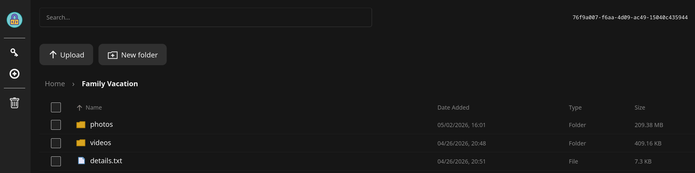
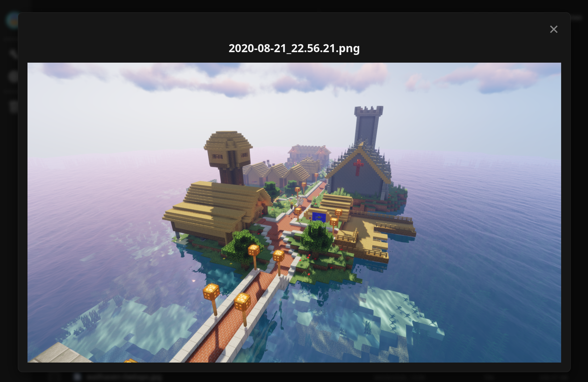

# ExoServe

<p align="center">  </p>

**ExoServe** is a self-hosted, **end-to-end encrypted** (E2EE) file storage solution. Designed specifically to be hosted on local hardware, it prioritizes privacy by utilizing **client-side encryption** of file contents, names, and directory topology. All cryptographic operations are handled exclusively on the client using a vanilla Javascript WebUI, ensuring the server never has access to unencrypted data or plaintext filenames.

Existing features include:

- **File Content Encryption:** All files are encrypted with cryptographically random, unique keys before leaving the device.
- **File System Encryption:** Directory structures are obfuscated using a **Merkle tree** and stored using **hash sharding**.
- **In-the-Dark Backend:** The server acts as a blob store with no knowledge of stored files.
- **Concurrent Sessions:** Safe multi-device synchronization with automatic race-condition handling.
- **WebUI:** Native browser interface for uploading, managing, and previewing files.

## Cryptographic Architecture

ExoServe utilizes a strict separation of concerns to maintain privacy. The frontend handles all cryptographic logic, while the backend handles storage.

### The In-the-Dark Server

The server has no knowledge of the file topology, file names, nor file types. When a user uploads a file, it is encrypted and authenticated using **AES-256-GCM**, which provides both confidentiality and data integrity. Each encrypted blob includes an authentication tag that allows the client to detect any modification, making tampering immediately detectable. Additionally, file names on the server are never stored plaintext; instead, each blob's filename is derived deterministically from its cryptographic hash (e.g., `sha256(encrypted_content)`), ensuring name-to-content binding and preventing aliasing attacks.

As a result, if a malicious actor compromises the server and attempts to alter blobs, they cannot generate valid authentication tags nor matching hashes without access to the plaintext or keys. Since all cryptographic operations are client-side, the server has no way to fabricate valid replacements.

The server does, however, store user authentication metadata, as described in **Authentication & Secrets**

### File System & Merkle Tree

To obfuscate the directory structure, the file system is built as an encrypted [Merkle tree](https://en.wikipedia.org/wiki/Merkle_tree).

| Node Type  | Metadata                                                                         | Cryptographic State                                                                              |
| ---------- | -------------------------------------------------------------------------------- | ------------------------------------------------------------------------------------------------ |
| **File**   | Contains the actual encrypted file contents.                                     | Encrypted with a **unique key**, randomly generated at upload.                                   |
| **Folder** | A dictionary linking child names to their respective hashes and decryption keys. | Encrypted with a **unique key** and re-hashed every time a child is added, deleted, or modified. |
| **Root**   | The master folder containing the top-level directory structure.                  | Encrypted with the **master key**.                                                               |

### Hash Sharding

On the backend, files are not saved in a traditional folder structure (e.g., `/photos/vacation.jpg`). Instead, they are saved using a technique called **hash sharding**.

When the server receives an encrypted blob, it verifies the integrity using the checksum and splits the hash to create a nested directory path within the user's sandbox. For example, a blob with the hash `a8f5f167...` would be saved to disk at `/sandbox/a8/f5/a8f5f167...`. This allows for highly efficient storage and retrieval of millions of files without hitting operating system directory limits, while keeping the true file hierarchy completely hidden.

## WebUI

### File Explorer Experience

<p align="center">  </p>

ExoServe features a lightweight, responsive WebUI built entirely in vanilla JavaScript. It provides a familiar file-explorer experience, including:

- breadcrumb navigation,
- column sorting,
- folder management,
- search,
- and a right-click context menu,

All while operating strictly within an e2ee paradigm.

### On-the-Fly Decryption

<p align="center">  </p>

A notable feature of the frontend is **on-the-fly media previewing** for images and videos. Rather than requiring a user to download and decrypt entire files to disk before viewing them, ExoServe utilizes a **Service Worker** to intercept standard browser network requests. As encrypted media chunks are streamed from the server, the Service Worker decrypts them within ephemeral memory and pipes the plaintext directly to the browser.

This architecture allows for scrubbing and streaming of encrypted media without a permanent footprint.

### Concurrent Session Support

The system handles race conditions automatically using atomic Compare-and-Swap (CAS) logic, protected by transient locks. **Uploads are staged in parallel**, while tree mutations are serialized to ensure integrity. This allows multiple sessions to interact with the server safely without data loss.

## Authentication & Secrets

> A forgotten password will result in total, irrecoverable data loss for the user. Always keep a copy in a secure, trusted location.

### Registration 

From the client point of view, account registration is composed of only a username and a password. However, the background process involves the following steps:

1. The username is mutated to derive a "custom/experimental" UUIDv8 compliant with RFC 9562. This is an irreversible mutation utilizing a truncated SHA-256 hash and the server never receives the original username, but neither the UUID nor the username is treated as secret.
1. The password and 16 bytes of salt are used to derive an **AES-256-GCM** master key using PBKDF2 and SHA-256 with 600,000 iterations.
1. A random **RSA-2048** RSASSA-PKCS1-v1.5 key pair is generated.
1. The private key is encrypted using the master key and 12-byte initialization vector (IV).
1. The UUID, salt, IV, public key, and encrypted private key are sent to the server for storage.

### Authentication

Logging in includes only a username and password, with the following steps for authentication:

1. The username is mutated to derive a "custom/experimental" UUIDv8 compliant with RFC 9562.
1. The client requests a challenge from the server for the UUID.
1. The server replies with the salt, IV, encrypted private key, and 32-byte nonce.
1. The password and salt are used to derive an **AES-256-GCM** master key using PBKDF2 and SHA-256 with 600,000 iterations.
1. The private key is decrypted using the master key and IV.
1. The nonce is signed using the decrypted private key.
1. The plaintext nonce and signed nonce are submitted to the server for the UUID.
1. The server verifies that the nonce has not expired (to mitigate replay attacks).
1. The server validates the signature using the public key for the UUID.
1. On success, the nonce is marked as expired and a session token is sent back to the client.
1. On failure, a generic 400 response is sent back to the client.

For all future communication with the server, the client must include the UUID and valid session token. This token will expire after one hour of inactivity.

**If the UUID does not exist on the server, the exact same process is still followed to mitigate user enumeration. Dummy data of the correct size and entropy is sent; the dummy data is deterministically derived from the UUID so that consecutive attempts with the same UUID will always return the same dummy data.**

**Note**: Future updates to the authentication system will introduce rate-limiting of challenge requests per UUID to mitigate offline brute-force attacks.

## Tech Stack

Special care was used to ensure the stack remains lightweight, dependency-free where possible, and highly customizable.

- **Frontend:** Built with **Vanilla JS**, HTML, and CSS. No heavy framework or package managers are required. The native Web Crypto API is used for all hashing and AES encryption.
- **Backend:** Built with **Python Flask**. Keeps the server logic simple, readable, and highly extensible for local environments.

## Deployment

ExoServe is designed to be run behind a reverse proxy to ensure secure traffic handling and privacy. Below is a recommended Nginx configuration template

### Nginx Configuration

```nginx
# =============================================================================
# EXOSERVE NGINX TEMPLATE
# =============================================================================
# Instructions:
# 1. Replace placeholders marked with <UPPERCASE>.
# 2. Ensure your ExoServe is running on the specified host/port.
# 3. Obtain SSL certificates (e.g., via Let's Encrypt/Certbot) and update paths.
# =============================================================================

# --- HTTP Server (Redirects to HTTPS) ---
server {
    listen 80;
    server_name <YOUR_DOMAIN>; # e.g., exoserve.example.com

    # Force all HTTP traffic to HTTPS
    return 301 https://$host$request_uri;
}

# --- HTTPS Server (Main Application) ---
server {
    listen 443 ssl;
    server_name <YOUR_DOMAIN>; # e.g., exoserve.example.com

    # Maximum file upload size (Adjust based on your needs)
    client_max_body_size 2G;

    # SSL Configuration
    ssl_certificate /path/to/fullchain.pem;
    ssl_certificate_key /path/to/privkey.pem;

    # Security Headers
    add_header X-Frame-Options "SAMEORIGIN" always;
    add_header X-Content-Type-Options "nosniff" always;
    add_header Referrer-Policy "strict-origin-when-cross-origin" always;
    add_header Strict-Transport-Security "max-age=31536000; includeSubDomains" always;

    # --- Data Transfer Endpoint (/node) ---
    # Handles both Uploads (POST) and Downloads (GET)
    # Logging is disabled here to save disk space and preserve privacy
    # Ensure backend application logging is also disabled for best results
    location /node {
        access_log off;

        proxy_pass http://<BACKEND_HOST>:<BACKEND_PORT>;
        proxy_set_header Host $host;
        proxy_set_header X-Real-IP $remote_addr;
        proxy_set_header X-Forwarded-For $proxy_add_x_forwarded_for;
        proxy_set_header X-Forwarded-Proto https;

        # Increase timeouts for large file transfers
        proxy_read_timeout 300s;
        proxy_send_timeout 300s;

        # Ensure body size limit applies here too
        client_max_body_size 2G;
    }

    # --- Main Application ---
    location / {
        proxy_pass http://<BACKEND_HOST>:<BACKEND_PORT>;
        proxy_set_header Host $host;
        proxy_set_header X-Real-IP $remote_addr;
        proxy_set_header X-Forwarded-For $proxy_add_x_forwarded_for;
        proxy_set_header X-Forwarded-Proto https;
    }
}
```

## The Fine Print

While the server has no knowledge at rest of file contents, file names, or directory topology, metadata could be ascertained while the data is in transit by monitoring live network traffic.

This is a standard convenience-versus-security tradeoff. The alternative is to:

- Have the client wholly download all files to mitigate streaming metadata leakage.
- Chunk files on the server to mitigate file size metadata leakage.
- Generate dummy traffic to obfuscate sequentially requested chunks being related.
- Throttle requests to a constant bitrate to mitigate rapidly requested chunks being related

This design is not currently on the roadmap, as the experience would be sluggish.
